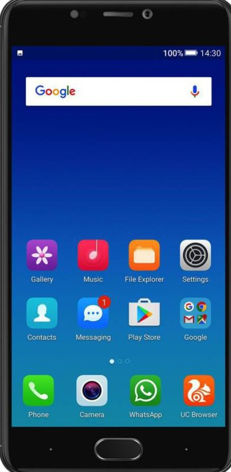
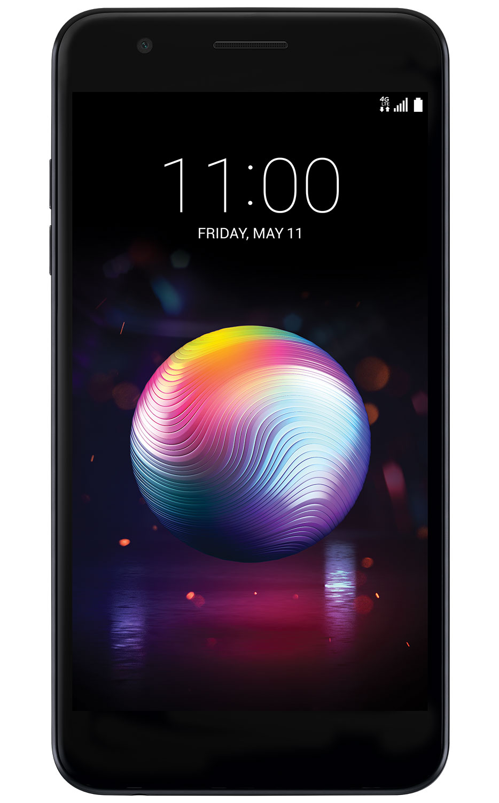
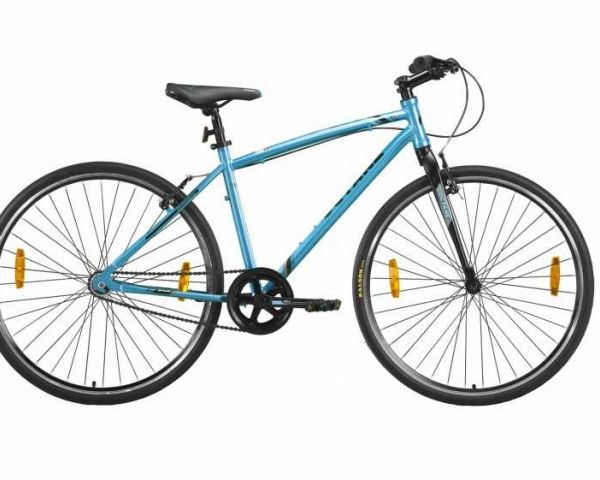

<!--DESCRIPTION:ASS BOOTSTRAP
AUTHOR:LAKSHMI
DATE:29-09-2018-->
<!DOCTYPE html>
<html>
<head>
<meta charset="utf-8">
<meta name="viewport" content="width=device-width, initial-scale=1.0">
<link rel="stylesheet" href="https://stackpath.bootstrapcdn.com/bootstrap/4.1.3/css/bootstrap.min.css">
<link rel="stylesheet" href="https://cdnjs.cloudflare.com/ajax/libs/font-awesome/4.7.0/css/font-awesome.min.css">
<link href="https://fonts.googleapis.com/css?family=Keania+One" rel="stylesheet">
<title>Bootstrap project2 </title>

</head>
<body>

<!--
 -->
<i class="fa fa-empire" style="font-size:36px;color:white;float:left;"></i>
<header>

APPERLE 

<pre>

 HOME    FEATURES    SCREENSHOTS    DOWNLOAD    NEWS <i class="fa fa-angle-down"></i>    PRICING    FAQs    CONTACT   <i class="fa fa-bars"></i>

</pre>
</header>

<h1 style="font-family: 'Keania One', cursive;font-size:100px;margin-top:130px;margin-left:120px;color:white;width:30%;">APPERLE </h1>

Lorem Ipsum dolor sit amet, consectetur adipisicing elit. Ad architecto  
deleniti,dicta facere fugit illum Elum laborum optio porro. 

FIND MORE ABOUT US 

<h2 style="text-align:center;">ABOUT APPERLE </h1>

Lorem Ipsum dolor sit amet, consectetur adipisicing elit. Ad architecto  
deleniti,dicta facere fugit illum Elum laborum optio porro.  
Lorem Ipsum dolor sit amet, consectetur adipisicing elit. Ad architecto   

<i class="fa fa-snowflake-o" style="font-size:36px;padding-left:194px;color:blue;"></i>
<h4 style="text-align:center;">Unique Layout </h4>

Lorem Ipsum dolor sit amet, consectetur  adipisicing elit.Aliquam dicta earum error  
incidunt laborum quibusdam? 

<i class="fa fa-pencil-square" style="font-size:36px;padding-left:194px;color:blue;"></i>
<h4 style="text-align:center;">Well Documented</h4>

Lorem Ipsum dolor sit amet, consectetur  adipisicing elit.Aliquam dicta earum error  
incidunt laborum quibusdam? 

<i class="fa fa-refresh" style="font-size:36px;padding-left:194px;color:blue;"></i>
<h4 style="text-align:center;">Super Fast</h4>

Lorem Ipsum dolor sit amet, consectetur  adipisicing elit.Aliquam dicta earum error  
incidunt laborum quibusdam? 

 
<h1 style="color:white;text-align:center;">FEATURES </h1>  

<!--<i class="fa fa-rocket" style="font-size:36px;padding-left:50px;padding-top:60px;"></i> -->
<h4 style="float:left;color:white;margin-left:320px;padding-top:45px;">Super Fast </h4>    

  Lorem Ipsum dolor sit amet , 
consectetur adipisicing elit.<i class="fa fa-rocket" style="font-size:36px;padding-left:30px;color:black;"></i>  
Ipsum nisi! 

 
 
 <!--  --> 
 

<h4 style="color:white;margin-left:226px;padding-top:164px;">Unlimited Features </h4>    

  Lorem Ipsum dolor sit amet , 
consectetur adipisicing elit.<i class="fa fa-lightbulb-o" style="font-size:36px;padding-left:30px;color:black;"></i>  
Ipsum nisi! 

 

<h4 style="color:white;margin-left:285px;padding-top:10px;">User Friendly </h4>    

  Lorem Ipsum dolor sit amet , 
consectetur adipisicing elit.<i class="fa fa-heartbeat" style="font-size:36px;padding-left:30px;color:black;"></i>  
Ipsum nisi! 

 
 

<h4 style="float:right;margin-right:265px;margin-top: -441px;color:white;">Retina Ready </h4>
<i class="fa fa-eye" style="font-size:36px;float:right;margin-right:430px;margin-top:-382px;color:black;"></i>

 Lorem Ipsum dolor sit amet , 
 consectetur adipisicing elit.  
 Ipsum nisi! 

 
 

<h4 style="float:right;margin-right:210px;margin-top: -299px;color:white;">Well Documented </h4>
<i class="fa fa-code" style="font-size:36px;float:right;margin-right:430px;margin-top:-242px;color:black;"></i>

 Lorem Ipsum dolor sit amet , 
 consectetur adipisicing elit.  
 Ipsum nisi! 

 
 

<h4 style="float:right;margin-right:243px;margin-top: -157px;color:white;">Super Powerful </h4>
<i class="fa fa-refresh" style="font-size:36px;float:right;margin-right:430px;margin-top:-99px;color:black;"></i>

 Lorem Ipsum dolor sit amet , 
 consectetur adipisicing elit.  
 Ipsum nisi! 

 
 

<h1 style="text-align:center;">SHOWCASE </h1>

Lorem Ipsum dolor sit amet, consectetur adipisicing elit. Ad architecto  
deleniti,dicta facere fugit illum Elum laborum optio porro.  
Lorem Ipsum dolor sit amet, consectetur adipisicing elit. Ad architecto   

<h4 style="margin-left:30px;">Eye catching details </h4>

Lorem Ipsum dolor sit amet, consectetur adipisicing elit.Ad   architecto
deleniti,dicta facere fugit illum Elum laborum optio   porro. 
Lorem Ipsum dolor sit amet, consectetur adipisicing elit. 

<h5 style="margin-left:29px;"> <i class="fa fa-rocket" style="font-size:36px;color:blue;"></i> Super Fast </h5>

Lorem Ipsum dolor sit amet, consectetur adipisicing elit   ipsum  nisi! 

<h5 style="margin-left:29px;"> <i class="fa fa-lightbulb-o" style="font-size:36px;color:blue;"></i> Unlimited Features </h5>

Lorem Ipsum dolor sit amet, consectetur adipisicing elit   ipsum nisi! 

  

  

<h4 style="margin-right:30px;">Unique Custom design </h4>

Lorem Ipsum dolor sit amet, consectetur adipisicing elit.Ad   architecto
deleniti,dicta facere fugit illum Elum laborum optio   porro. 
Lorem Ipsum dolor sit amet, consectetur adipisicing elit. 

<h5> <i class="fa fa-cogs" style="font-size:36px;color:blue;"></i> Super Fast </h5>

Lorem Ipsum dolor sit amet, consectetur adipisicing elit   ipsum  nisi! 

<h5> <i class="fa fa-comments" style="font-size:36px;color:blue;"></i> Full Chat </h5>

Lorem Ipsum dolor sit amet, consectetur adipisicing elit   ipsum nisi! 

<h4 style="margin-left:30px;">Awesome built-in features.</h4>

Lorem Ipsum dolor sit amet, consectetur adipisicing elit.Ad   architecto
deleniti,dicta facere fugit illum Elum laborum optio   porro. 
Lorem Ipsum dolor sit amet, consectetur adipisicing elit. 

<h5 style="margin-left:29px;"> <i class="fa fa-eye" style="font-size:36px;color:blue;"> </i> Super Fast </h5>

Lorem Ipsum dolor sit amet, consectetur adipisicing elit   ipsum  nisi! 

<h5 style="margin-left:29px;"> <i class="fa fa-heartbeat" style="font-size:36px;color:blue;"></i> Unlimited Features </h5>

Lorem Ipsum dolor sit amet, consectetur adipisicing elit   ipsum nisi! 

  

<h2 style="padding-top:62px;float:left;margin-left:145px;">SUBSCRIBE </h2>

Email 
<i class="fa fa-paper-plane" style="font-size:36px;float:right;color:white;background-color:blue;width:20%;
height:40px;border-radius:20px;"></i> 

<h1 style="text-align:center;">SCREENSHOTS </h1>

Lorem Ipsum dolor sit amet, consectetur adipisicing elit. Ad architecto  
deleniti,dicta facere fugit illum Elum laborum optio porro.  
Lorem Ipsum dolor sit amet, consectetur adipisicing elit.Shimmoga   

		

		<!--indicators-->
		<ul class="carousel-indicators">
			<li data-target="#my-carousel" data-slide-to="0"
			class="active"> </li>
			<li data-target="#my-carousel" data-slide-to="1"> </li>
			<li data-target="#my-carousel" data-slide-to="2"> </li>
		</ul>
		
		

		<!--sliding items-->
		

			
			<!--add caption  here-->
		

			
scenery 1

		

	

	

		
		

			
scenery 2

		

		

		

		
		

			
scenery 3

		

		

	

<!--inner-->
<!--left & right controls-->
<a class="carousel-control-prev" href="#my-carousel" data-slide="prev">
	 
	</a>
	
<a class="carousel-control-next" href="#my-carousel" data-slide="next">
	 
	</a>
	

	

<h1 style="color:white;">TESTIMONIAL </h1>
 

Lorem Ipsum dolor sit amet, consectetur adipisicing elit.Ad   architecto
deleniti,dicta facere fugit illum Elum laborum optio   porro. 
Lorem Ipsum dolor sit amet, consectetur adipisicing elit. 
 
<h4 style="color:white;">John Deo </h4> 
<i class="fa fa-star" style="color:yellow;"></i><i class="fa fa-star" style="color:yellow;"></i>
<i class="fa fa-star" style="color:yellow;"></i><i class="fa fa-star" style="color:yellow;"></i>
<i class="fa fa-star" style="color:yellow;"></i>

<h1>BEHIND THE STORY </h1>

Lorem Ipsum dolor sit amet, consectetur adipisicing elit.Ad   architecto
deleniti,dicta facere fugit illum Elum laborum optio   porro. 
Lorem Ipsum dolor sit amet, consectetur adipisicing elit. 
  

   
<h4 style="color:blue;padding-left:70px;">Sandra More </h4>

Web Developer 
 
 

  
<h4 style="color:blue;padding-left:90px;">John Snow </h4>

Creation Studio 
 
 

  
<h4 style="color:blue;padding-left:85px;">David Bobby </h4>

UI/UX Designer 
  
 

 

<h1 style="text-align:center;color:white;">GET IT NOW </h1>

The new apperle App lorem ipsum dolor sit amet,consectetur  
adipisicing elit. In veniam! Lorem ipsum dolor sit amet,  
consectetur. 

<i class="fa fa-apple" style="color:white;font-size:24px;padding-left:10px;padding-top:6px;"></i>
 available on   <b style="padding-left:25px;"> Apple Store </b> 
 

 

 

<i class="fa fa-android" style="color:white;font-size:24px;padding-left:10px;padding-top:6px;"></i>
 available on   <b style="padding-left:25px;"> Google Store</b> 
 

 

 

<i class="fa fa-windows" style="color:white;font-size:24px;padding-left:10px;padding-top:6px;"></i>
 available on   <b style="padding-left:25px;"> Windows Store</b> 
 
 
 

 
Scan QR Code 

<h1>LATEST NEWS</h1>

The new apperle App lorem ipsum dolor sit amet,consectetur  
adipisicing elit. In veniam! Lorem ipsum dolor sit amet,  
consectetur. 
  

			
		

			<h4 class="card-title">Lorem Ipsum dolor sit amet, consectetur adipisicing elit.Ad architecto
deleniti,dicta facere fugit illum Elum laborum optio</h4>
			

			<a href="#" class="btn btn-info" style="border:1px solid black;border-radius:15px;">Read more </a>
		

 

				
		

			<h4 class="card-title">Lorem Ipsum dolor sit amet, consectetur adipisicing elit.Ad architecto
deleniti,dicta facere fugit illum Elum laborum optio</h4>
			

			<a href="#" class="btn btn-info" style="border:1px solid black;border-radius:15px;">Read more </a>
		

 

						
		

			<h4 class="card-title">Lorem Ipsum dolor sit amet, consectetur adipisicing elit.Ad architecto
deleniti,dicta facere fugit illum Elum laborum optio</h4>
			

			<a href="#" class="btn btn-info" style="border:1px solid black;border-radius:15px;">Read more </a>
		

 

<h1 style="color:white;">WATCH VIDEO</h1>

Lorem Ipsum dolor sit amet, consectetur adipisicing elit.Ad architecto
deleniti,dicta facere   fugit illum Elum laborum optio
 
<i class="fa fa-youtube-play" style="font-size:68px;color:white;"></i> 

 

<h1>Prices</h1>

The new apperle App lorem ipsum dolor sit amet,consectetur  
adipisicing elit. In veniam! Lorem ipsum dolor sit amet,  
consectetur. 
  

			<h3>Freelancer </h3> 

			
 <b> $10.99 </b>/month
 
 

		

			<h4 class="card-title">Support Forum   Free Hosting   50GB of Free Storage  
			Admin Area</h4>
			

			<a href="#" class="btn btn-info" style="border:1px solid black;border-radius:15px;">Buy Now</a>
		

 

			<h3>One Project </h3> 

			
 <b> $10.99 </b>/month
 
 

		

			<h4 class="card-title">Support Forum   Free Hosting   50GB of Free Storage  
			Admin Area</h4>
			

			<a href="#" class="btn btn-info" style="border:1px solid black;border-radius:15px;">Buy Now</a>
		

 

			<h3>Multiple project </h3> 

			
 <b> $10.99 </b>/month
 
 

		

			<h4 class="card-title">Support Forum   Free Hosting   50GB of Free Storage  
			Admin Area</h4>
			

			<a href="#" class="btn btn-info" style="border:1px solid black;border-radius:15px;">Buy Now</a>
		

 

  

 <h1 style="color:white;">STATISTICS</h1>

The new apperle App lorem ipsum dolor sit amet,consectetur  
adipisicing elit. In veniam! Lorem ipsum dolor sit amet,  
consectetur. 
  

<i class="fa fa-heart" style="font-size:36px;padding-left:30px;"></i>   Happy Clients   1232  

<i class="fa fa-cloud-download" style="font-size:36px;padding-left:34px;"></i>   App Downloads    64K  

<i class="fa fa-reddit-alien" style="font-size:36px;padding-left:30px;"></i>   Active Users    1811  

<i class="fa fa-star" style="font-size:36px;padding-left:22px;"></i>   Total Rates    232  

 
<h1> FAQs </h1>

The new apperle App lorem ipsum dolor sit amet,consectetur  
adipisicing elit. In veniam! Lorem ipsum dolor sit amet,  
consectetur. 
  

 
 

<i class="fa fa-comment" style="font-size:14px;color:white;"></i>Why this app is so awesome?  - 

Lorem Ipsum dolor sit amet, consectetur adipisicing elit.Ad architecto
deleniti,dicta facere   fugit illum Elum laborum optio
 

<i class="fa fa-comment" style="font-size:14px;color:white;"></i> Can I get discount by inviting friends? +  

<i class="fa fa-comment" style="font-size:14px;color:white;"></i> Lorem Ipsum sit amet, adipisicing. +  

<i class="fa fa-comment" style="font-size:14px;color:white;"></i>et labore laboriosam molestias,ligendi. + 

<i class="fa fa-comment" style="font-size:14px;color:white;"></i> Lorem Ipsum dolor sit amet,consectetur. +  

adgjl 

<h2 style="text-align:center;">GET IN TOUCH </h2>

<i class="fa fa-map-marker" style="font-size:36px"></i> 15 Bath Rd,Heathrow, 
 Longford ,Hounslow TWB   2AB, UK. 

 <i class="fa fa-user" style="font-size:36px;padding-left:120px;"></i> Name* 
 
 
 

 <i class="fa fa-paper-plane-o" style="font-size:24px;padding-left:120px;"></i> Email* 
 

 <i class="fa fa-phone" style="font-size:24px"></i> +444 123 156 152 

 <i class="fa fa-envelope-o" style="font-size:24px;padding-left:120px;"></i> Message* 

 <i class="fa fa-paper-plane" style="font-size:24px;"></i>perk.app@example.com
 

Send Message 

 <i class="fa fa-stop-circle-o" style="font-size:24px;float:right;color:blue;margin-right:174px;"></i> 
<i class="fa fa-twitter-square" style="font-size:24px;float:right;color:blue;padding-left:30px;padding-right:30px;"></i> 
<i class="fa fa-facebook-square" style="font-size:24px;float:right;color:blue;"></i>

</body>
</html>
